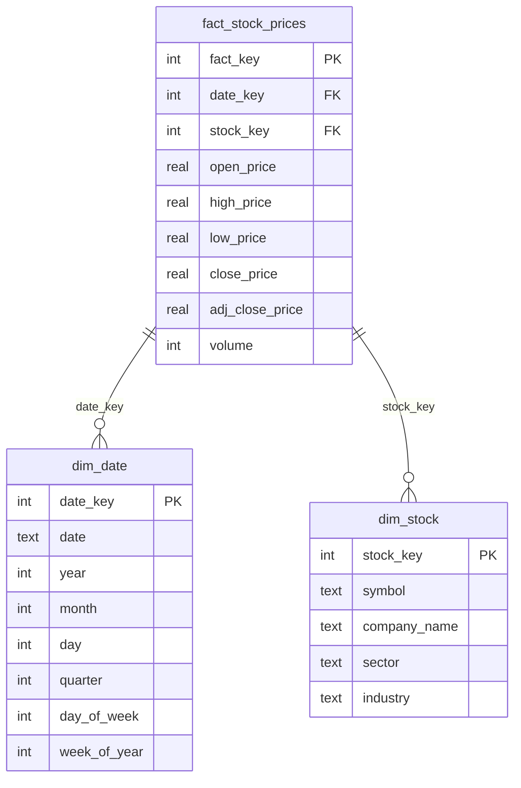

# 📈 Stock Market Analytics System

>A data warehouse system using star schema design for analyzing stock market data with real-time fetching from Yahoo Finance.

## Features

- ⭐ Star schema data design
- 📊 Real-time market data
- 🌐 Interactive web interface
- 📉 Visual analytics with Plotly 
- 💾 SQLite database for persistent storage

## Installation

1. **Clone or download this repository**

2. **Create a virtual environment:**
   ```bash
   python -m venv venv
   ```

3. **Activate the virtual environment:**
   ```bash
   venv\\Scripts\\activate
   ```
   > **Mac/Linux:** Use `source venv/bin/activate` instead

4. **Upgrade pip and install dependencies:**
   ```bash
   pip install --upgrade pip
   pip install --only-binary :all: numpy pandas
   pip install -r requirements.txt
   ```
   > **Mac/Linux:** You can skip the `--only-binary` command and just run `pip install -r requirements.txt`

5. **Initialize the database:**
   ```bash
   python -m scripts.initialize_db
   ```

## Usage

1. Start the web server:
   ```bash
   python -m src.web.app
   ```

2. Open your browser to `http://127.0.0.1:5000`

3. Add stocks using their ticker symbols (AAPL, GOOGL, MSFT, etc.)

4. Click on any stock to view detailed analytics

## Database Schema

### Star Schema Design


**Fact Table:**
- `fact_stock_prices` - Daily stock price data

**Dimension Tables:**
- `dim_date` - Date dimensions (year, month, quarter, week)
- `dim_stock` - Stock information (symbol, company, sector, industry)

## Project Structure

- `src/database/` - Database models and warehouse logic
- `src/data/` - Data loading and ETL processes
- `src/web/` - Flask web application
- `tests/` - Unit tests
- `scripts/` - Utility scripts
- `config/` - Configuration files

## Contributing

Pull requests are welcome! For major changes, please open an issue first.

## License


MIT

