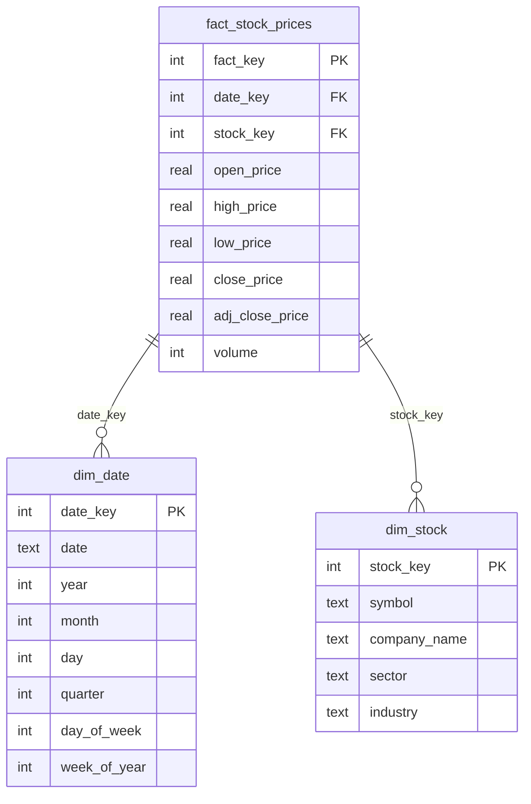

# 📈 Stock Market Analytics System

>A data warehouse system using star schema design for analyzing stock market data with real-time fetching from Yahoo Finance.


## 🐍 Prerequisites

**Python 3.8+** is required. Don't have Python? 

[](https://www.python.org/downloads/)

## Features

- ⭐ Star schema data design
- 📊 Real-time market data
- 🌐 Interactive web interface
- 📉 Visual analytics with Plotly 
- 💾 SQLite database for persistent storage

## 📂 Project Structure
```
stock-analytics/
├── 📊 src/                     # Source code
│   ├── 🗄️ database/
│   │   ├── __init__.py
│   │   └── warehouse.py        # Star schema & data warehouse logic
│   ├── 📥 data/
│   │   ├── __init__.py
│   │   └── loader.py           # Yahoo Finance ETL processes
│   └── 🌐 web/
│       ├── __init__.py
│       ├── app.py              # Flask application
│       └── templates/
│           └── index.html      # Dashboard UI
├── 🧪 tests/                   # Unit tests
│   ├── __init__.py
│   └── test_warehouse.py
├── ⚙️ scripts/                 # Utility scripts
│   └── initialize_db.py        # Database initialization
├── 🔧 config/                  # Configuration
│   ├── __init__.py
│   └── config.py               # App settings
├── 💾 data/                    # Database storage
│   └── stock_warehouse.db      # SQLite database (gitignored)
├── 📄 requirements.txt         # Python dependencies
├── 📝 README.md
└── ⚙️ setup.py
```

## Installation

1. **Clone or download this repository**

2. **Create a virtual environment:**
   ```bash
   python -m venv venv
   ```

3. **Activate the virtual environment:**
   ```bash
   venv\\Scripts\\activate
   ```
   > **Mac/Linux:** Use `source venv/bin/activate` instead

4. **Upgrade pip and install dependencies:**
   ```bash
   pip install --upgrade pip
   pip install --only-binary :all: numpy pandas
   pip install -r requirements.txt
   ```
   > **Mac/Linux:** You can skip the `--only-binary` command and just run `pip install -r requirements.txt`

5. **Initialize the database:**
   ```bash
   python -m scripts.initialize_db
   ```

## Usage

1. Start the web server:
   ```bash
   python -m src.web.app
   ```

2. Open your browser to `http://127.0.0.1:5000`

3. Add stocks using their ticker symbols (AAPL, GOOGL, MSFT, etc.)

4. Click on any stock to view detailed analytics

## Database Schema

### Star Schema Design


**Fact Table:**
- `fact_stock_prices` - Daily stock price data

**Dimension Tables:**
- `dim_date` - Date dimensions (year, month, quarter, week)
- `dim_stock` - Stock information (symbol, company, sector, industry)

## 🛠️ Tech Stack

- **Backend:** Python, SQLite
- **Frontend:** HTML, CSS, JavaScript

## Contributing

Pull requests are welcome! For major changes, please open an issue first.

## 📝 License

MIT License

Copyright (c) 2025 Thomas Harrison

Permission is hereby granted, free of charge, to any person obtaining a copy
of this software and associated documentation files (the "Software"), to deal
in the Software without restriction, including without limitation the rights
to use, copy, modify, merge, publish, distribute, sublicense, and/or sell
copies of the Software, and to permit persons to whom the Software is
furnished to do so, subject to the following conditions:

The above copyright notice and this permission notice shall be included in all
copies or substantial portions of the Software.

THE SOFTWARE IS PROVIDED "AS IS", WITHOUT WARRANTY OF ANY KIND, EXPRESS OR
IMPLIED, INCLUDING BUT NOT LIMITED TO THE WARRANTIES OF MERCHANTABILITY,
FITNESS FOR A PARTICULAR PURPOSE AND NONINFRINGEMENT. IN NO EVENT SHALL THE
AUTHORS OR COPYRIGHT HOLDERS BE LIABLE FOR ANY CLAIM, DAMAGES OR OTHER
LIABILITY, WHETHER IN AN ACTION OF CONTRACT, TORT OR OTHERWISE, ARISING FROM,
OUT OF OR IN CONNECTION WITH THE SOFTWARE OR THE USE OR OTHER DEALINGS IN THE
SOFTWARE.


